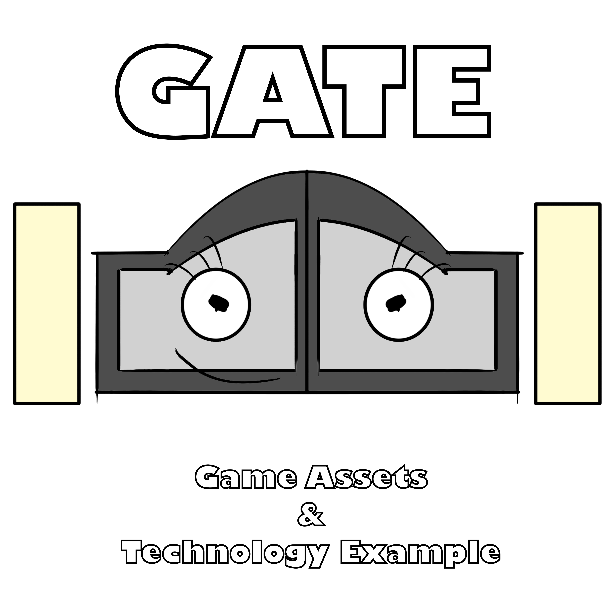

# Game Assets & Technology Example (Unity version)

    

## Tech demo and project template

The **Game Assets & Technology Example** is an open-source game project template designed to help 
game developers make their own games. It includes a fully functional game that comes with 
a main menu, a game level, a playable character, enemy NPCs, a task/quest system, full 
controller support, and a save/load system.

## Demo

A built version of the project can be found under [Releases](https://github.com/JJNCreator/GATEUnity/releases) as well as on [Itch.io](https://jjncreator.itch.io/gate-unity).

## Getting the project

This version of the project is for **Unity** Developers. If you're an Unreal, Godot, or Roblox user, please go to GATEUnreal (coming soon), GATEGodot (coming soon), or GATERoblox (coming soon).

This project currently uses **Unity 2023.1.20f1**.

Here are the steps:
1. Select "Use this template" and go through the steps.
2. Clone the new repository using your Git client.
3. Once cloning is done, open the project in Unity Hub.

## Issues/Bug Reports

Please report any bugs and/or issues to the [GATE Discord server](https://discord.gg/RjA9fCw2hT).